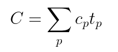
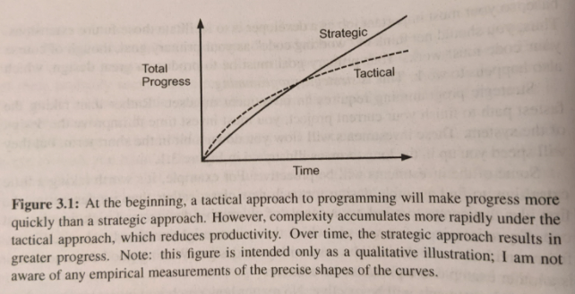

# A Philosophy of Software Design

> _By John Ousterhout (Stanford University)_

These are notes taken from the v1.0.1 edition of the book, printed in November 2018.

- [A Philosophy of Software Design](#a-philosophy-of-software-design)
  - [Summary of Design Principles](#summary-of-design-principles)
  - [Preface](#preface)
  - [Chapter 1: Introduction (It's All About Complexity)](#chapter-1-introduction-its-all-about-complexity)
    - [The Waterfall Method](#the-waterfall-method)
    - [Agile Development](#agile-development)
  - [Chapter 2: The Nature of Complexity](#chapter-2-the-nature-of-complexity)
    - [Manifestations of complexity](#manifestations-of-complexity)
      - [Change amplification](#change-amplification)
      - [Cognitive load](#cognitive-load)
      - [Unknown unknowns](#unknown-unknowns)
    - [Causes of complexity](#causes-of-complexity)
  - [Chapter 3: Working Code Isn't Enough (Strategic vs. Tactical Programming)](#chapter-3-working-code-isnt-enough-strategic-vs-tactical-programming)
    - [Tactical programming](#tactical-programming)
    - [Strategic programming](#strategic-programming)
      - [How much to invest?](#how-much-to-invest)
  - [Chapter 4: Modules Should Be Deep](#chapter-4-modules-should-be-deep)

## Summary of Design Principles

1. Complexity is incremental; you have to sweat the small stuff.
2. Working code isn't enough.
3. Make continual investments to improve system design.
4. Modules should be deep.
5. Interfaces should be designed to make the most common usage as simple as possible.
6. It's more important for a module to have a simple interface than a simple implementation.
7. General-purpose modules are deeper.
8. Separate general-purpose and special-purpose code.
9. Different layers should have different abstractions.
10. Pull complexity downward.
11. Define errors (and special cases) out of existence.
12. Design it twice.
13. Comments should describe things that are not obvious from the code.
14. Software should be designed for ease of reading, not ease of writing.
15. The increments of software development should be abstractions, not features.

## Preface

There has been considerable discussion about agile development, debuggers, version control systems, test coverage tools, object-oriented programming, functional programming, design patterns, and algorithms. The core problem of software design has not been addressed, **_problem decomposition_** (_i.e._ reducing complexity).

> Further reading: [_On the Criteria To Be Used in Decomposing Systems into Modules_](./documents/criteria_david_parnas.pdf) by David Parnas (1971)

Problem decomposition is how to take a complex problem and divide it up into pieces that can be solved independently.

Many people assume that software design skill is an innate talent that cannot be taught. However, there is quite a bit of scientific evidence that outstanding performance in many fields is related more to high-quality practice than innate ability (_Talent is Overrated_ by Geoff Colvin).

John Ousterhout created a course at Stanford called [CS 190](https://web.stanford.edu/~ouster/cgi-bin/cs190-winter21/index.php) in order to teach software design.

Best way to reach John about the book is to send an email to software-design-book@googlegroups.com or check out [John's homepage](https://web.stanford.edu/~ouster/cgi-bin/book.php) about the book.

> I recommend that you take the suggestions in this book with a grain of salt. The overall goal is to reduce complexity; this is more important than any particular principle or idea you read here.

## Chapter 1: Introduction (It's All About Complexity)

> Writing computer software is one of the purest creative activities in the history of the human race. Programmers aren't bound by practical limitations such as the laws of physics; we can create exciting virtual worlds with behaviours that could never exist in the real world. Programming doesn't require great physical skill or coordination, like ballet or basketball. All programming requires is a creative mind and the ability to organize your thoughts. If you can visualize a system, you can probably implement it in a computer program.

The greatest limitation in writing software is our ability to understand the systems we are creating.

There are two general approaches to fighting complexity:

1. Making code simpler and more obvious
   - _e.g._ eliminating special cases or using identifiers in a consistent fashion
2. Encapsulating complexity, so that programmers can work on a system without being exposed to all of its complexity at once.

This second approach is called a *__modular design__*, where a software system is divided up into _modules_, such as classes in an object-oriented language. The modules are designed to be relatively independent of each other, so that a programmer can work on one module without having to understand the details of other modules.

Software design is a continuous process that spans the entire lifecycle of a software system.
Software should not be designed like a physical system (_e.g._ buildings, ships, bridges).

### The Waterfall Method

A horrible way to design software is the _waterfall model_:

- project divided into discrete phases
  - requirements definition
  - design
  - coding
  - testing
  - maintenance
- each phase completes before the next starts
- usually different people are responsible for each phase
- entire system designed at once, during the design phase (frozen at the end of the phase for implementation phase)

The initial design will have many problems, and problems do not become apparent until implementation is underway. The waterfall method cannot also not accommodate for major design changes, so developers try to patch around problems without changing the overall design. This results in an explosion of complexity.

### Agile Development

Agile development is referred to an incremental alternative to the waterfall method:

- the initial design focuses on a small subset of the overall functionality
- this subset is designed, implemented, and then evaluated
- each iteration exposes problems with the existing design, which are fixed before the next set of features is designed

By following the agile development method, problems with the initial design can be fixed while the system is still small. Later features benefit from experience gained during the implementation of earlier features, so they have fewer problems.

An incremental approach works for software, but it also means that software design is never done. Incremental development also means continuous redesign.

> The initial design for a system or a component is almost never the best one; experience inevitably shows better ways to do things.

One of the best ways to improve your design skills is to learn to recognize red flags: signs that a piece of code is probably more complicated than it needs to be.

> If you take any design idea to its extreme, you will probably end up in a bad place. Beautiful designs reflect a balance between competing ideas and approaches.

## Chapter 2: The Nature of Complexity

Recognizing complexity allows you to identify problems before you invest a lot of effort in them, and it allows you to make good choices among alternatives.

> **Complexity is anything related to the structure of a software system that makes it hard to understand and modify the system.**

Complexity can take many forms:

- it might be hard to understand how a piece of code works
- it might take a lot of effort to implement a small improvement
- it might not be clear which parts of the system must be modified to make the improvement
- it might be difficult to fix one bug without introducing another

If a software system is hard to understand and modify, then it is complicated.
In a complex system, it takes a lot of work to implement small improvements.

If a software system is easy to understand and modify, then it is simple.
In a simple system, larger improvements can be implemented with less effort.

Complexity is determined by what code is modified more often:

Overall complexity of a system (**_C_**) is determined by the complexity of each part **_p_** (**_cp_**) weighted by the fraction of time developers spend working on that part (**__tp__**).

If there is code that is very complex, but is isolated and rarely modified, then that is a win.

> Complexity is more apparent to readers than writers.
> If you write code that seems simple to you, but others find it complex, then it is complex.

We want to not only create code that we can work with easily, but also make code that others can work with easily.

### Manifestations of complexity

Complexity manifests itself in three general ways:

1. Change amplification
2. Cognitive load
3. Unknown unknowns

#### Change amplification

Change amplification occurs when what seems to be a simple change instead requires code modifications in many different places.

An example would be an old website requiring you to set the background color on each page. If you have a hundred pages you have to make a hundred changes. Instead, in the modern web we would assign a colour to a variable, and use that variable. Now to change the colour for all the backgrounds you change the colour assigned to the variable.

#### Cognitive load

Cognitive load refers to how much a developer needs to know in order to complete a task. This means more time spent learning rather than coding, and there is a possibility that bugs will occur because of incomplete information.

For example, cognitive load can arise from:

- APIs with many methods
- Global variables
- Inconsistencies
- Dependencies between modules

It is wrong to assume that `complexity = lines of code` and that the shorter solution must be simpler. This is not true if those few lines do not tell the developer what is really going on or if they have written the code incorrectly.

> **Sometimes an approach that requires more lines of code is actually simpler, because it reduces cognitive load.**

#### Unknown unknowns

> Of the three manifestations of complexity, unknown unknowns are the worst.

It is not obvious which pieces of code must be modified to complete a task, or what information a developer needs to implement the solution successfully.
Oftentimes you won't find out about an issue until bugs appear after your change. A change may depend on a subtle design decision that was never documented.

> One of the most important goals of good design is for a system to be _obvious_. (Chapter 18 discusses this further)

### Causes of complexity

> Complexity is incremental.

Complexity comes from an accumulation of two things:

1. Dependencies
   - lead to change amplification and high cognitive load
2. Obscurity
   - creates unknown unknowns and high cognitive load

A **_dependency_** exists when a piece of code cannot be understood and modified in isolation. This dependent code relates to other code, and this other code must be considered/modified if the dependent code is changed.

For example, the signature of a method creates a dependency between the method implementation and the code invoking it. If a new parameter is added to a method, all of the invocation of the method must be modified to specify the new parameter.

Dependencies are not inherently bad, but we want to reduce the number of dependencies, and make them as simple and obvious as possible.

**_Obscurity_** occurs because of inadequate documentation (Chapter 13 talks about this more). However, if a system has an obvious design, it will need less documentation. The need for extensive documentation is often a red flag that the design isn't quite right.

> The best way to reduce obscurity is by simplifying the system design.

## Chapter 3: Working Code Isn't Enough (Strategic vs. Tactical Programming)

Many organizations encourage a tactical mindset: "focus on getting features working as quickly as possible".

If you want good design, you need a more strategic approach where you invest time to produce clean designs and fix problems. This is cheaper over the long run.

### Tactical programming

> Tactical programming makes it nearly impossible to produce a good system design.

Tactical programming is short-sighted, you're trying to finish a task as quickly as possible. This is how systems become complicated, rationalizing that a bit of complexity will be fine if it "gets something working".

Refactoring will help in the long run, but a tactical approach has you making quick patches to work around problems because of the growing complexity (_i.e. "refactoring will slow down the current task"_).

> Almost every software development organization has at least one developer who takes tactical programming to the extreme: a _tactical tornado_. The tactical tornado is a prolific programmer woh pumps out code far faster than others but works in a totally tactical fashion. When it comes to implementing a quick feature, nobody gets it done faster than the tactical tornado. In some organizations, management treats tactical tornadoes as heroes. However, tactical tornadoes leave behind a wake of destruction. They are rarely considered heroes by the engineers who must work with their code in the future. Typically, other engineers must clean up the messes left behind by the tactical tornado, which makes it appear that those engineers (who are the real heroes) are making slower progress than the tactical tornado.

### Strategic programming

> **_Working code isn't enough._**
>
> **_Your primary goal must be to produce a great design, which also happens to work._**

It is not acceptable to introduce unnecessary complexities in order to finish your current task faster.

> **_The most important thing is the long-term structure of the system._**

Most of the code in any system is written by extending the existing code base. The most important job as a developer is to facilitate those future extensions.

Strategic programming requires an investment mindset. Invest time to improve the system design, rather than taking the fastest path to "finish".

For example:

- take time to find a simple design for each new class
- don't implement the first idea that comes to mind
- try a couple of alternative designs and pick the cleanest one
- try to imagine a few ways in which the system might need to be changed in the future and make sure that will be easy with the design
- writing good documentation is a good proactive investment

If you are programming strategically, you will be continually making small improvements to the system design.

#### How much to invest?

A huge up-front investment, like designing the entire system, won't be effective. This is the waterfall method, and we know it doesn't work.

The best approach is to make small investments on a continual basis.

**John suggests spending ~10-20% of development time on investments.**

The project will take ~10-20% longer than the tactical approach, but you will have better software design. The simplified design will speed up development later on.

Conversely, if you program tactically, you will finish the project ~10-20% faster, but development speed will slow as complexity accumulates.

Many startups will try to rationalize the tactical approach by hiring extra engineers to clean up the mess after the startup is successful.
**Once a code base turns to spaghetti, it is nearly impossible to fix.** Startups following the tactical approach will incur high development costs for the life of the product.

The best engineers care deeply about design. If the code base is a mess then you will likely continue to recruit mediocre engineers and your system structure will continue to degrade.

> **_It's a lot more fun to work in a company that cares about software design and has a clean code base._**

There will always be a "time crunch", it will be tempting to put off and delay design improvements until after the crunch, but there will always be another one. If you continue to delay design improvements, the development will slowly devolve into a tactical approach.

The most effective approach is one where every engineer makes continuous small investments in good design.

## Chapter 4: Modules Should Be Deep

We should aim to design systems so that developers only need to face a fraction of the overall complexity at any given time (_i.e._ modular design).

**Modular design** decomposes a software system into a collection of _modules_ that are relatively independent.

Modules could be:

- Classes
- Methods or functions within a class
- Subsystems
- Services

The goal of modular design is to minimize the dependencies between modules.

Each module is made up of two parts:

1. An interface (_what_ a module does)
   - consists of everything that a developer working in a different module must know in order to use the given module.
2. An implementation (_how_ a module does what the interface describes)
   - consists of the code that carries out the promises made by the interface.

A developer should not need to understand the implementations of modules other than the one they are working on. They will obviously need to know the interfaces [of the given module + dependencies].

The best modules are those whose interfaces are much simpler than their implementations. This provides two advantages:

1. A simple interface minimizes the complexity that a module imposes on the rest of the system.
2. If a module is modified in a way that does not change its interface, then no other module will be affected by the modification.
